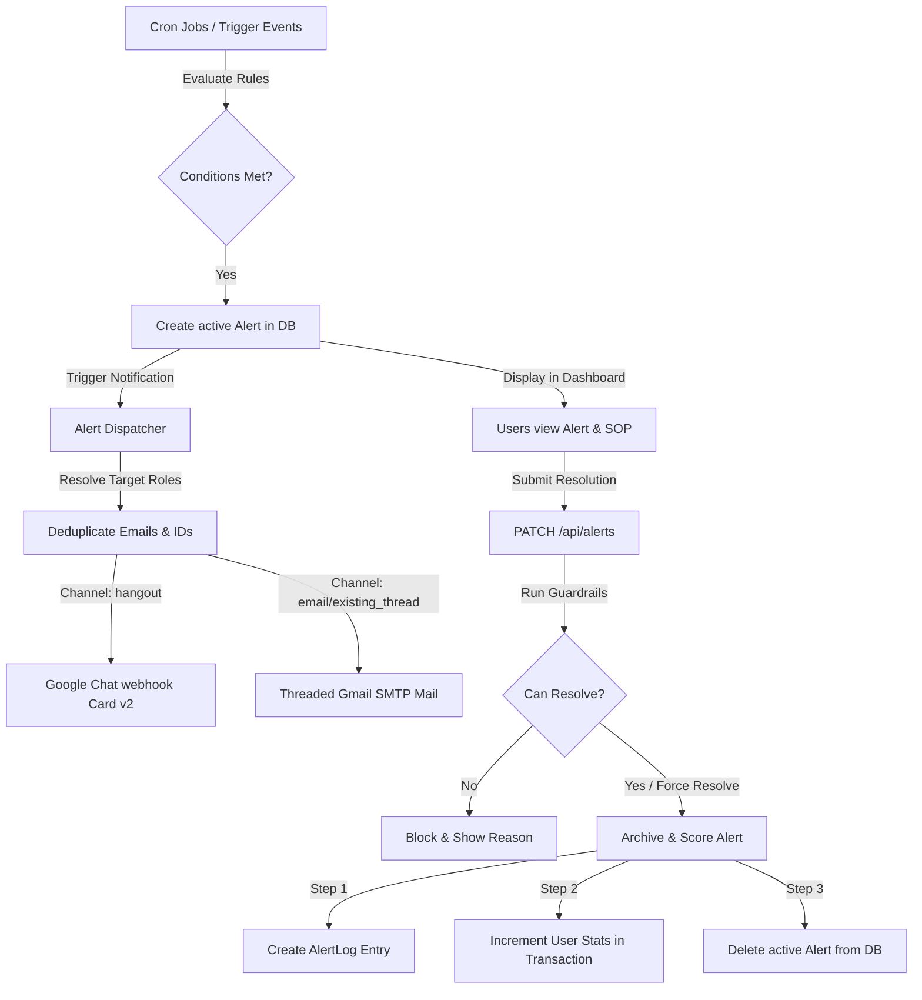
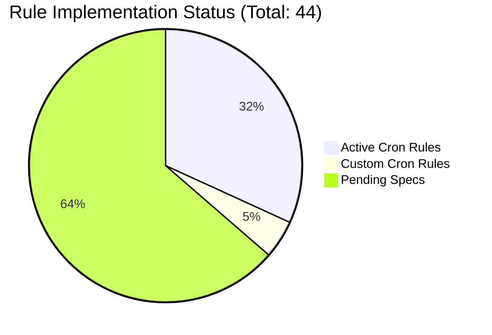

# Warehouse Returns Management System: Alert System Documentation

This document provides a comprehensive overview of the **Alert System** in the Warehouse Returns Management System. It explains the alert levels, how alerts are triggered, active delivery channels, resolution workflows with data-driven guardrails, and current live database statistics.

---

## 1. System Overview & Architecture

The alert system detects operational bottlenecks, SLA breaches, and data discrepancies (e.g., packages marked delivered by couriers but not received at the warehouse). When an anomaly is detected, the system creates an alert, notifies targeted users, and guides them through Standard Operating Procedures (SOPs) for resolution.

---

## 2. Alert Levels & Target Roles

Alerts are classified into four hierarchical levels, matching operational severity and escalation logic:

| Level | Delivery Channels | Purpose / Escalation Path |
| :--- | :--- | :--- |
| **L1** | Dashboard + Hangout card | In-app nudges targeted at operational staff (e.g., RECEIVER, INSPECTOR). |
| **L2** | Dashboard + Email (New thread) | Email escalations to administrators or group mail lists. |
| **L3** | Dashboard + Email (Threaded reply) | Follow-up escalations. Sent as replies to the existing email thread. |
| **L4** | Dashboard + Email (Threaded reply) + Leadership Alerts | Critical escalations. Leadership (e.g., Sunil Deshmukh, Harsh Jain) and `SUPER_ACCESS` users are notified. |

### Target Roles Resolution
Target roles configured in alert rules are resolved dynamically using [lib/alertTargeting.ts](file:///e:/documents/project1/wearhouse-testing/lib/alertTargeting.ts):
- **Alert Levels (L1–L4)**: Targets users with matching `alertLevel` values in the DB.
- **Roles**: Case-insensitively maps to Prisma `Role` enum values (`RECEIVER`, `INSPECTOR`, `QC_AGENT` (QC), `RECOVERER` (RECOVERY), `ADMIN`, `SUPER_ACCESS`, `CLAIMS_SPECIALIST`).
- **Direct Emails**: Direct email addresses (identified by `@`) are included as-is.

---

## 3. How Alerts are Triggered

Alerts are evaluated and created primarily by background cron jobs running hourly/daily in [lib/cron.ts](file:///e:/documents/project1/wearhouse-testing/lib/cron.ts).

### A. Expected Tracking Cron (`runExpectedTrackingJob`)
* **Frequency**: Every 1 hour
* **Flow**:
  1. Identifies manifests in `EXPECTED` or `IN_TRANSIT` status.
  2. Sequential scraping of carrier status (e.g., Bluedart) via Playwright.
  3. Updates manifest status and carrier delivery timestamps.
  4. **Ghost Delivery Type 1 Check**: If the courier marked a package as delivered but it was never scanned by the receiver at the dock:
     - **SLA $\ge$ 6 working hours**: Triggers `GHOST_DELIVERY_T1_6H` (L2)
     - **SLA $\ge$ 12 working hours**: Triggers `GHOST_DELIVERY_T1_12H` (L3)
     - **SLA $\ge$ 24 working hours**: Triggers `GHOST_DELIVERY_T1_24H` (L4)

### B. Escalations Cron (`runEscalationsJob`)
* **Frequency**: Every 1 hour
* **Checks & Evaluations**:
  * **Receiver-Inspector Handshake Pending**: Packages at the dock (`AT_DOCK`) received but not handed to an inspector:
    - Passed yesterday, current time $\ge$ 10:00 AM: `RECV_INSP_HANDSHAKE_10AM` (L1)
    - Passed yesterday, current time $\ge$ 12:00 PM: `RECV_INSP_HANDSHAKE_12PM` (L2)
    - Passed yesterday, current time $\ge$ 3:00 PM: `RECV_INSP_HANDSHAKE_3PM` (L3)
    - Received prior to yesterday, current time $\ge$ 10:00 AM: `RECV_INSP_HANDSHAKE_NEXT_DAY` (L4)
  * **Inspection Pending**: Handed over to Inspector but inspection remains incomplete:
    - $\ge$ 6 working hours: `INSPECTION_PENDING_6H` (L1)
    - $\ge$ 12 working hours: `INSPECTION_PENDING_12H` (L2)
    - $\ge$ 18 working hours: `INSPECTION_PENDING_18H` (L3)
    - $\ge$ 24 working hours: `INSPECTION_PENDING_24H` (L4)
  * **Inspection QC Failed (Claims Staging)**: Failed inspection QC but claim has not been raised:
    - $\ge$ 6 working hours: `INSPECTION_QC_FAILED_6H` (L2)
    - $\ge$ 12 working hours: `INSPECTION_QC_FAILED_12H` (L3)
    - $\ge$ 24 working hours: `INSPECTION_QC_FAILED_24H` (L4)
  * **Inspector-Recovery Handshake Pending**: SKU marked for recovery after inspection, handover to recovery pending:
    - $\ge$ 12 working hours: `INSP_RECOVERY_HANDSHAKE_12H` (L1)
    - $\ge$ 18 working hours: `INSP_RECOVERY_HANDSHAKE_18H` (L2)
  * **Ghost Delivery (L4)**: `EXPECTED` packages where carrier ETA is overdue by 48+ hours.
  * **Missing Items (L3)**: Triggered in real-time when inspection logs missing items.

### C. Time Calculation & Tier Escalations
- **Warehouse Working Hours**: Time differences are calculated using the configured warehouse schedule (default `09:00 - 18:00` in the `Asia/Kolkata` timezone), ignoring non-operational hours.
- **Alert Suppression & Auto-archiving**: If a higher-tier alert triggers (e.g., L3 instead of L2), the system archives the lower-tier alert as `ESCALATED` via `archiveAndScoreAlerts`, keeping only the highest-severity alert active for the manifest.

---

## 4. Notification Delivery Channels

Notifications are handled by [lib/alertDispatcher.ts](file:///e:/documents/project1/wearhouse-testing/lib/alertDispatcher.ts):

### A. Google Chat (Hangouts) Webhook
Sends a rich Cards v2 layout to Google Chat.
- **Webhook URL**: Read from `GOOGLE_CHAT_WEBHOOK_URL` in environment variables.
- **Content**: Includes the alert subject, priority level, tracking ID, dynamic description, warning icons, and visual card styling.

### B. Email Threading via SMTP Gmail
Sends an HTML email with Nodemailer.
- **Email Threading Logic**: To avoid cluttered inboxes, escalations for the same manifest are grouped into a single email thread:
  1. When sending an `email_existing_thread` alert, it retrieves `lastEmailMessageId` from the manifest.
  2. Sets SMTP headers `In-Reply-To` and `References` to reference the previous Message-ID.
  3. Updates `lastEmailMessageId` on the manifest with the new SMTP Message-ID for subsequent alerts.

---

## 5. Resolution Workflow & Data Guardrails

Alerts are resolved through the dashboard UI. The REST API endpoint `PATCH /api/alerts` enforces strict checks before allowing a user to resolve an alert.

### A. Enforcing Target Permissions
A user can only resolve an alert if they are:
- An **ADMIN** or **SUPER_ACCESS** user.
- Explicitly connected to the alert as a target user (`targetUsers`).
- The alert's `targetRoles` includes the user's role or alert level.

### B. Data-Driven Guardrails (`checkResolvable`)
To prevent users from marking alerts resolved without actually fixing the underlying issue, the API runs validation checks:

| Alert Category | Condition for Resolution | Error Message if Blocked |
| :--- | :--- | :--- |
| **Delivery Breaches & Ghost Delivery** | Manifest status must not be `EXPECTED`. (Delivery must be scanned, or transit claim filed). | *"[trackingId] is still in 'Expected' status. Ensure the delivery is received or a transit claim is filed first."* |
| **Receive Update Pending** | Manifest status must be past `AT_DOCK`. (Acceptance must be confirmed). | *"[trackingId] is still at the dock. Complete receiver acceptance in the system first."* |
| **Receiver-Inspector Handshake** | Manifest status must be in `IN_INSPECTION` or beyond. | *"[trackingId] has not been handed over to inspection yet..."* |
| **Inspection Pending** | Manifest status must be `INSPECTED`, `CLAIMS_STAGING` or beyond. | *"Inspection for [trackingId] is not complete yet..."* |
| **QC Failures & Rejections** | Manifest must have a `claimId` filed in the system. | *"No claim has been filed for [trackingId]. File the claim in Amazon Seller Central and add the Claim ID to the manifest before resolving."* |
| **Inventorisation & Handshakes to QC** | Manifest status must be `RECOVERED_TO_INVENTORY`. | *"[trackingId] has not been inventorised yet..."* |

*Note: Admins or Super-Access users can bypass this check using `forceResolve: true`.*

---

## 6. Archiving & Performance Scoring

To optimize database performance and track team performance:
1. **Pruning**: When an alert is resolved or escalated, it is **deleted** from the active `Alert` table, freeing database rows.
2. **AlertLog**: A lightweight historical entry is created in the `AlertLog` table to preserve auditing data (A AWB tracking ID, alert type, resolved by user, status: `RESOLVED` or `ESCALATED`, and whether the SOP was acknowledged).
3. **Performance Scoring**: In a transactional query, the targeted users' metrics (`alertsResolved` or `alertsEscalated`) are incremented on their `User` profiles.
4. **Historical Pruning**: The escalations cron job automatically purges `AlertLog` entries older than 365 days.

---

## 7. Current Alert Rules Registry

The registry at [lib/alertRules.ts](file:///e:/documents/project1/wearhouse-testing/lib/alertRules.ts) contains **42 defined alert rules** across 15 categories. 

### Implementation Status
Currently, **14 rules** are actively implemented in cron checks, while **28 rules** serve as documented specifications pending future triggers. Additionally, **2 custom rules** are implemented in the cron scripts.

Here is a list of the 15 alert categories:

| # | Alert Group | Rules Count | Status | Implemented Types |
| :--- | :--- | :---: | :--- | :--- |
| 1 | **Delivery ETA breach** | 3 | Pending Specs | |
| 2 | **Marked delivered incorrectly (Type 1)** | 3 | **Active** | `GHOST_DELIVERY_T1_6H`, `GHOST_DELIVERY_T1_12H`, `GHOST_DELIVERY_T1_24H` |
| 3 | **Marked delivered incorrectly (Type 2)** | 3 | Pending Specs | |
| 4 | **Receive update pending** | 2 | Pending Specs | |
| 5 | **Receiver-Inspector handshake pending** | 4 | **Active** | `RECV_INSP_HANDSHAKE_10AM`, `RECV_INSP_HANDSHAKE_12PM`, `RECV_INSP_HANDSHAKE_3PM`, `RECV_INSP_HANDSHAKE_NEXT_DAY` |
| 6 | **Inspection pending** | 4 | **Active** | `INSPECTION_PENDING_6H`, `INSPECTION_PENDING_12H`, `INSPECTION_PENDING_18H`, `INSPECTION_PENDING_24H` |
| 7 | **Inspection QC failed** | 3 | **Active** | `INSPECTION_QC_FAILED_6H`, `INSPECTION_QC_FAILED_12H`, `INSPECTION_QC_FAILED_24H` |
| 8 | **Inspector-Recovery handshake pending** | 2 | **Active** | `INSP_RECOVERY_HANDSHAKE_12H`, `INSP_RECOVERY_HANDSHAKE_18H` |
| 9 | **Recovery rejection 1** | 2 | Pending Specs | |
| 10 | **Recovery rejection 2** | 3 | Pending Specs | |
| 11 | **Recovery-QC handshake pending** | 2 | Pending Specs | |
| 12 | **Inspector-QC handshake pending** | 2 | Pending Specs | |
| 13 | **QC rejection 1** | 2 | Pending Specs | |
| 14 | **QC rejection 2** | 3 | Pending Specs | |
| 15 | **Inventorisation pending** | 4 | Pending Specs | |
| - | **Custom Cron Evaluated Rules** | 2 | **Active** | `GHOST_DELIVERY` (L4 ETA Overdue), `MISSING_ITEMS` (L3 Claims) |

---

## 8. Current Database Statistics

Running diagnostics on the active database yields the following state:

### Active Alerts
* **Total Active Alerts**: **17**
* **Level Distribution**:
  * **L4**: 17 active alerts
  * **L1 / L2 / L3**: 0 active alerts
* **Type Distribution**:
  * `GHOST_DELIVERY_T1_24H`: 17 active alerts (indicating 17 removal order shipments marked delivered by the carrier over 24 hours ago but not yet scanned at the dock).

### Historical Metrics (`AlertLog`)
* **Total Historical Logs**: **0** (All logs are clean or have been archived/cleared).

### Configured User Profiles & Performance Scores
Below is a list of registered users in the database and their accumulated alert scores:

| User Identifier | Role | Alert Level | Alerts Received | Alerts Resolved | Alerts Escalated |
| :--- | :--- | :---: | :---: | :---: | :---: |
| **rr** | RECEIVER | L1 | 0 | 0 | 0 |
| **ADMIN** | ADMIN | L3 | 0 | 0 | 0 |
| **RECEIVER** | RECEIVER | *None* | 0 | 0 | 0 |
| **inspector** | INSPECTOR | *None* | 0 | 0 | 0 |
| **kruti@cubelelo.com** | SUPER_ACCESS | L3 | 0 | 0 | 0 |
| **vedant** | SUPER_ACCESS | L4 | 0 | 0 | 0 |
| **test super_access@11** | SUPER_ACCESS | L4 | 0 | 0 | 0 |
